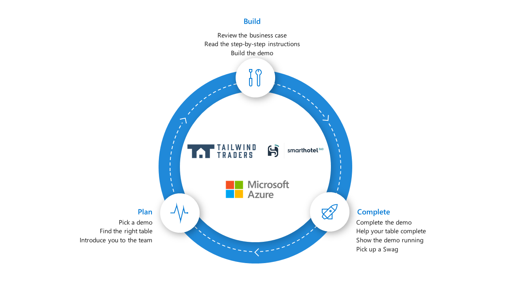
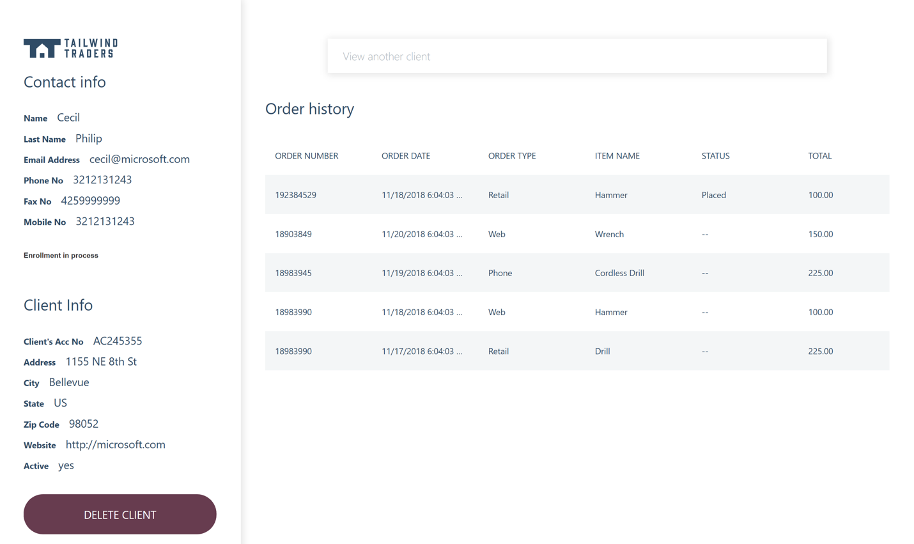

# Azure Apps Workshop

## Create more impact with real-world Azure demos

Doing demonstrations of Azure Services for developers to customers could be challenging, especially if you want to show how multiple services work together to solve a concrete business challenge. Learn how to use the same demos and resources that Microsoft uses at major events like //Build, Ignite and Connect();. We will be showcasing two end-to-end scenarios called SmartHotel360 and Tailwind Traders, to demonstrate how customers can migrate to Azure and excite audiences with unlimited cloud capabilities, from App Services, to Functions, AKS, DevOps, Xamarin and more.

### Workshop Plan

-------------------------
### Choose your adventure

| Demo​                               | Description​                                                                           | Repository​                         |
|------------------------------------|---------------------------------------------------------------------------------------|------------------------------------|
| [Modernizing .NET Apps with Azure App Services](#Modernizing-NET-apps-with-Azure-App-Services)​    | Migrating ASP.NET WebForms App to Azure App Service and modernizing with Serverless. ​ | Tailwind Traders (Rewards)​         |
| [Managing Backend Services with AKS](#managing-backend-services-with-aks)​ | Run multi-language based microservices on Azure Kubernetes Service. ​                  | Tailwind Traders (AKS)​             |
| [Managing Windows Containers in AKS](#managing-windows-containers-in-aks)​                       | Deploy a .NET Framework Application to AKS using Windows Containers                                  | SmartHotel360 Registration​ |
| [Azure DevOps and GitHub](#Azure-DevOps-and-GitHub])​                             | Setup continuous automated pipelines from GitHub to Azure.​                            | Tailwind Traders (Website)​         
-------------------------
## Modernizing .NET Apps with Azure App Services
 
Tailwind Traders is expanding their business world-wide, they need to be able to support millions of users without have to worry about the infrastructure, that's why they need to migrate an ASP.NET WebForms application. In this walkthrough, we’ll take the on-premises application with the database and migrate it to Azure; then we will modernize the application with serverless to automate a process in the application without modifying the code base.
 
**Source code:** https://github.com/Microsoft/TailwindTraders-Rewards

**Demo Script:** [Modernization with App Services](https://github.com/Microsoft/TailwindTraders/tree/master/Documents/DemoScripts/Modernizing%20.NET%20Apps#modernizing-net-apps)

[Back to Top](#choose-your-adventure)

-------------------------
## Managing Backend Services with AKS

Tailwind Traders have built a set of microservices that work as backend for their applications, they have containerized and to manage those they want to use Azure Kubernetes Services to take advantage of features such as auto-patching, auto-scaling and updates support. These walkthroughts will show how to deploy the containers, use virtual nodes and Dev Spaces capabilities to get a great inner loop development experience with Kubernetes on Azure.

**Source code**: [https://github.com/Microsoft/TailwindTraders-Backend](https://github.com/Microsoft/TailwindTraders-Backend)

**Demo Script**: [Managing backend with Azure Kubernetes Service (AKS)](https://github.com/Microsoft/TailwindTraders/tree/master/Documents/DemoScripts/Managing%20backend%20with%20Azure%20Kubernetes%20Service%20(AKS))

[Back to Top](#choose-your-adventure)

-------------------------
## Managing Windows Containers in AKS

SmartHotel360 wants to modernize a multi-tier .NET Framework application, they would like to containerized it using Windows Containers and deploy it to Azure Kubernetes Services to take advantage of features such as auto-patching, auto-scaling and updates support. This walkthrought will show how to deploy a Windows Container in AKS.

**Source code**: [https://github.com/microsoft/SmartHotel360-Registration](https://github.com/microsoft/SmartHotel360-Registration)

**Demo Script**: [Managing Windows Containers in AKS](https://github.com/microsoft/SmartHotel360-Registration)

[Back to Top](#choose-your-adventure)

-------------------------
## Azure DevOps and GitHub

The Tailwind Traders team uses GitHub for hosting their source code and use Azure Pipelines for continuous integration and continuous delivery to quickly deploy their changes to Azure. Their public website will be hosted in Azure, and they want to automate the entire process so that they can spin up all the infrastructure needed to deploy and host the application without any manual intervention.

Tailwind Traders team, like most DevOps teams practices continuous planning. They connect Azure Boards with their GitHub repositories to take advantage of the rich project management capabilities provided by Azure Boards that spans Kanban boards, backlogs, team dashboards, and custom reporting, etc.,

**Source code:** [https://github.com/Microsoft/TailwindTraders-Website](https://github.com/Microsoft/TailwindTraders-Website)

**Demo Script:** [Azure DevOps + GitHub](https://github.com/Microsoft/TailwindTraders/tree/master/Documents/DemoScripts/Integrating%20Azure%20Pipelines%2C%20GitHub%20and%20Azure%20Boards#integrating-azure-pipelines-github-and-azure-boards)

[Back to Top](#choose-your-adventure)

# Feedback

We would love to improve the content of this workshop for you, please let us know your valuable input [using this survey](https://forms.office.com/Pages/ResponsePage.aspx?id=v4j5cvGGr0GRqy180BHbR5QLLLTqNRJPu88tkErU0pxUMjVCMlM5QVQ4SllJT1MwN1hPMUZVVUI4Wi4u).
